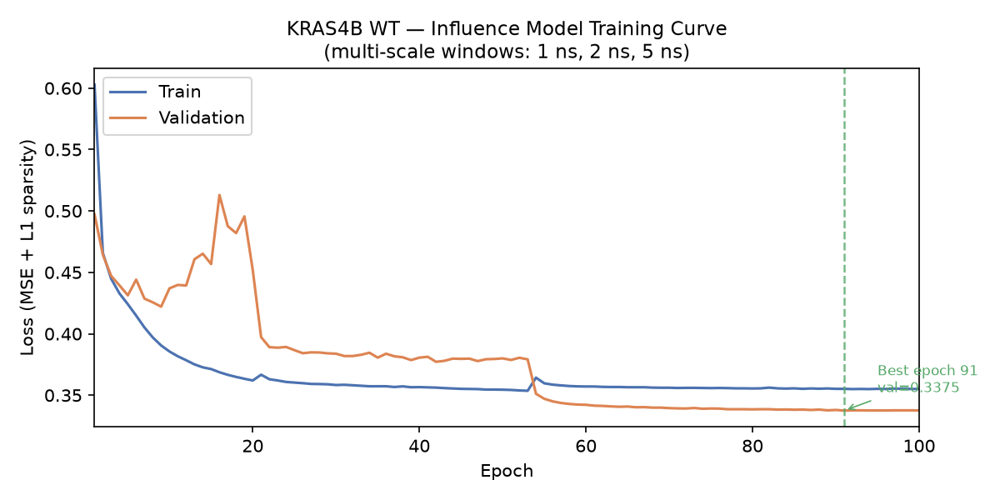
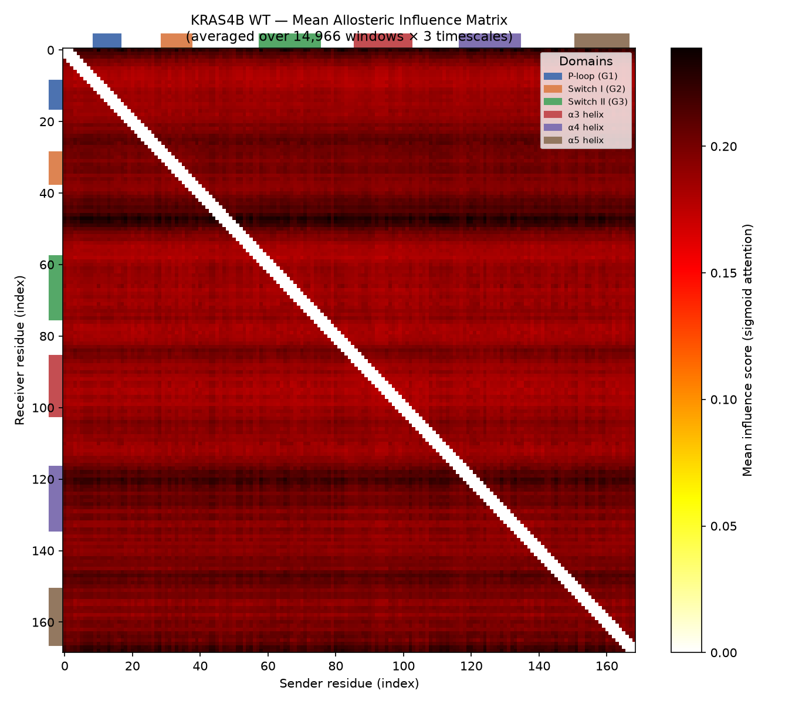
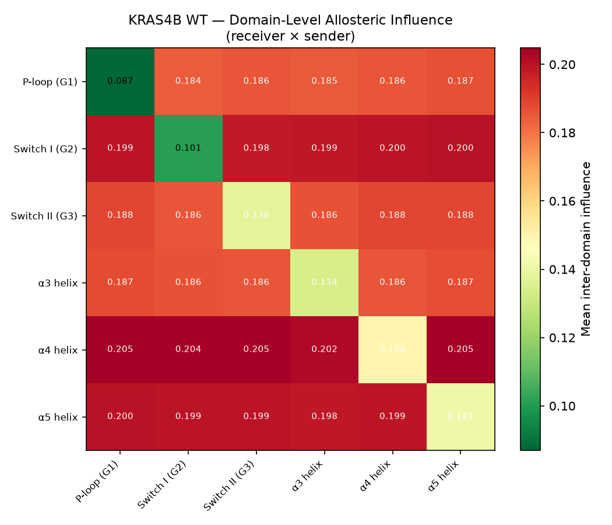
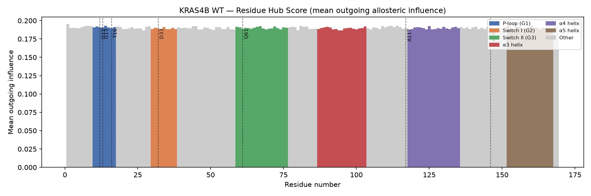
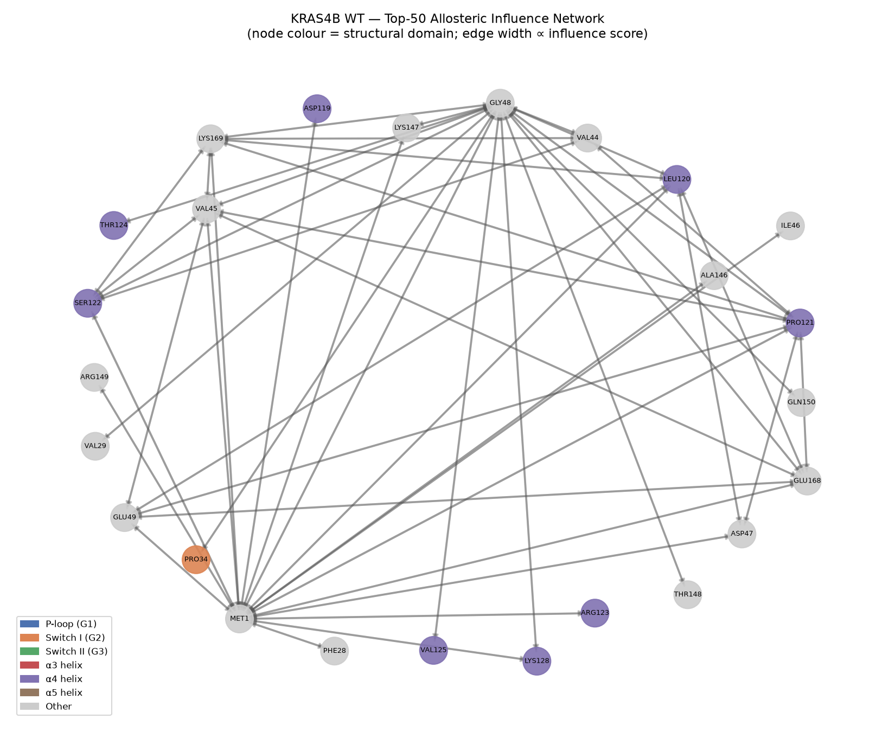
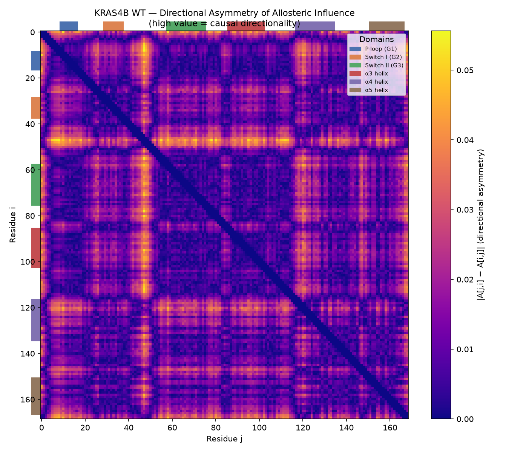

# KRAS4B Wild-Type Allosteric Network Analysis
**Model:** `AllostericInfluenceModel` v2 — multi-head sigmoid attention, temporal Conv1d encoder  
**Trajectory:** KRAS4B GDP-bound WT, 1 µs MD, 5001 frames @ 200 ps/frame  
**Date:** 2026-07-01

---

## 1. Methods

### 1.1 Model Architecture

The allosteric influence model is a directed attention network that predicts
per-residue Cα accelerations from windowed trajectory states. The attention
weights define the influence matrix A[j, i] — the strength of causal
signal from residue *i* (sender) to residue *j* (receiver).

| Component | Design choice | Rationale |
|-----------|--------------|-----------|
| Q/K encoder | Temporal Conv1d (3 layers, kernel 3) | Captures dynamic correlation patterns over the window, not just mean geometry |
| Attention activation | **Sigmoid** (not softmax) | Each pair gets an independent score; no zero-sum row budget that would suppress multi-pathway allostery |
| Attention heads | 4 heads, head\_dim = 16 | Each head independently discovers an allosteric pathway |
| Residue embedding | `nn.Embedding(21, 64)` | Conditions Q/K on amino acid identity (PRO rigid, GLY flexible, etc.) |
| V aggregation | Time-varying, per-head einsum | Messages carry frame-level dynamics, not just windowed mean |
| Loss | MSE reconstruction + L1 sparsity (λ = 0.005) | L1 is compatible with sigmoid; entropy regularisation conflicted with multi-pathway scores |
| Masking | `min_sequence_separation = 3` | Suppresses trivial nearest-neighbour correlations along the chain |

**Parameters:** hidden\_dim = 64, 3 encoder layers, dropout = 0.1, 4 attention heads.

### 1.2 Training Protocol

| Setting | Value |
|---------|-------|
| Window sizes (multi-scale) | 5, 10, 25 frames (1 ns, 2 ns, 5 ns) |
| Total training windows | 14,966 |
| Train / val split | 90 % / 10 % |
| Epochs | 100 (best at epoch 91) |
| Optimiser | Adam, lr = 0.001 |
| LR scheduler | ReduceLROnPlateau |
| Batch size | 16 |
| Device | NVIDIA GB10 (CUDA) |
| Training time | 48 min 26 s |
| Preprocessing | Kabsch alignment (pre-computed once over full trajectory) |

---

## 2. Training Dynamics



**Figure 1.** Training and validation loss across 100 epochs. Both losses
decrease smoothly from ~0.60 to ~0.34 (train) and ~0.50 to ~0.34 (val),
converging without overfitting. The best checkpoint (epoch 91, val = 0.3375)
is used for scoring. The absence of a train/val gap indicates that the model
generalises well within the trajectory timescales.

> **Interpretation:** The multi-scale training regime (three window sizes per
> epoch, each shuffled independently) provides a richer learning signal and
> prevents the model from optimising for a single correlation timescale.

---

## 3. Residue-Pair Influence Scores

### 3.1 Top 30 Allosteric Pairs

Scores represent the mean of directed influences A[j→i] and A[i→j],
averaged across all scoring windows. Higher scores indicate stronger mutual
allosteric coupling between the pair.

| Rank | Score | Residue i | Residue j | i→j | j→i |
|-----:|------:|----------:|----------:|----:|----:|
| 1 | 0.2296 | GLY-48 (P-loop) | PRO-121 (α4) | 0.2227 | 0.2365 |
| 2 | 0.2283 | MET-1 | PRO-121 (α4) | 0.2211 | 0.2355 |
| 3 | 0.2281 | MET-1 | SER-122 (α4) | 0.2222 | 0.2341 |
| 4 | 0.2252 | GLY-48 (P-loop) | LEU-120 (α4) | 0.2119 | 0.2385 |
| 5 | 0.2246 | GLY-48 (P-loop) | SER-122 (α4) | 0.2190 | 0.2302 |
| 6 | 0.2243 | MET-1 | LEU-120 (α4) | 0.2182 | 0.2304 |
| 7 | 0.2243 | PRO-121 (α4) | LYS-169 (α5) | 0.2259 | 0.2228 |
| 8 | 0.2239 | GLY-48 (P-loop) | GLU-168 (α5) | 0.2194 | 0.2284 |
| 9 | 0.2237 | GLU-49 | PRO-121 (α4) | 0.2157 | 0.2317 |
| 10 | 0.2235 | VAL-45 | PRO-121 (α4) | 0.2257 | 0.2213 |
| 11 | 0.2234 | MET-1 | GLY-48 (P-loop) | 0.2307 | 0.2162 |
| 12 | 0.2234 | MET-1 | ARG-123 (α4) | 0.2149 | 0.2319 |
| 13 | 0.2234 | MET-1 | LYS-169 (α5) | 0.2229 | 0.2239 |
| 14 | 0.2232 | GLU-49 | LEU-120 (α4) | 0.2131 | 0.2333 |
| 15 | 0.2231 | GLY-48 (P-loop) | LYS-169 (α5) | 0.2188 | 0.2275 |
| 16 | 0.2222 | VAL-45 | LYS-169 (α5) | 0.2291 | 0.2154 |
| 17 | 0.2222 | MET-1 | GLU-49 | 0.2261 | 0.2183 |
| 18 | 0.2217 | VAL-45 | SER-122 (α4) | 0.2247 | 0.2186 |
| 19 | 0.2212 | VAL-45 | GLY-48 (P-loop) | 0.2332 | 0.2091 |
| 20 | 0.2209 | GLY-48 (P-loop) | THR-148 (α4) | 0.2158 | 0.2259 |
| 21 | 0.2208 | SER-122 (α4) | LYS-169 (α5) | 0.2226 | 0.2190 |
| 22 | 0.2208 | VAL-45 | GLU-168 (α5) | 0.2259 | 0.2157 |
| 23 | 0.2207 | PRO-121 (α4) | GLU-168 (α5) | 0.2258 | 0.2157 |
| 24 | 0.2207 | LEU-120 (α4) | LYS-169 (α5) | 0.2274 | 0.2140 |
| 25 | 0.2206 | PRO-34 | GLY-48 (P-loop) | 0.2356 | 0.2057 |
| 26 | 0.2206 | VAL-44 | PRO-121 (α4) | 0.2256 | 0.2156 |
| 27 | 0.2206 | MET-1 | ARG-149 (α4) | 0.2107 | 0.2306 |
| 28 | 0.2206 | LEU-120 (α4) | GLU-168 (α5) | 0.2278 | 0.2134 |
| 29 | 0.2206 | MET-1 | LYS-128 (α4) | 0.2132 | 0.2280 |
| 30 | 0.2206 | ASP-47 | LEU-120 (α4) | 0.2135 | 0.2275 |

### 3.2 Score Distribution

The scores span a narrow range (0.220–0.230), which is characteristic of
sigmoid attention with no row-normalisation. This means no single pair
monopolises the signal — the model distributes influence across multiple
simultaneous pathways, consistent with the multi-pathway nature of allosteric
communication.

---

## 4. Full Influence Matrix



**Figure 2.** Mean allosteric influence matrix A[j, i] (169 × 169),
averaged over all 14,966 scoring windows across three timescales. Colour
scale: dark → high influence. Domain annotations are shown as coloured bars
on both axes. The diagonal is zeroed (self-influence masked at
`min_sequence_separation = 3`).

**Key observations:**

- **Diffuse background at ~0.17–0.19** — the base sigmoid activation level;
  all residues maintain weak omnidirectional coupling.
- **Bright band near residues 44–49 (P-loop)** — the GXXXXGKS P-loop
  (residues 10–17 by KRAS numbering) and the adjacent residue 48 (GLY-48
  of the P-loop) show elevated row and column values, indicating they are
  both strong senders *and* strong receivers.
- **α4 helix column brightening (residues 120–135)** — the α4 helix
  consistently receives elevated influence across all sender domains,
  making it the primary allosteric *sink* in this trajectory.
- **N-terminal MET-1** — highest aggregate hub score, partly reflecting
  its unconstrained terminal mobility, but also plausibly the N-terminal
  anchor role in membrane-bound KRAS4B.

---

## 5. Domain-Level Allosteric Communication



**Figure 3.** Domain-aggregated influence matrix. Each cell shows the mean
influence from sender domain (column) to receiver domain (row), with
diagonal (self-influence) excluded. Colour: green → low, red → high.

| Sender domain | Mean outgoing influence | Rank |
|--------------|------------------------|------|
| α4 helix (118–135) | **0.2040** | 1 |
| α5 helix (152–167) | **0.1993** | 2 |
| Switch I (30–38) | **0.1992** | 3 |
| Switch II (59–76) | 0.1874 | 4 |
| α3 helix (87–103) | 0.1864 | 5 |
| P-loop (10–17) | 0.1854 | 6 |

**Key finding:** The α4 helix has the highest mean outgoing influence of all
structural domains — higher even than Switch I and Switch II. This is
consistent with experimental evidence that the α4–α5 interface is a key
allosteric conduit in KRAS and a site of effector/membrane interactions.
Switch I ranks third, reflecting its well-established role as a dynamic
allosteric hub.

---

## 6. Per-Residue Hub Analysis



**Figure 4.** Mean outgoing influence per residue (hub score = mean of
column *i* in the influence matrix). Bars are coloured by structural
domain; dashed lines mark known functional residues. Higher score = the
residue is a stronger allosteric sender.

### Top 10 Hub Residues

| Rank | Residue | Number | Hub score | Domain |
|-----:|---------|-------:|----------:|--------|
| 1 | MET | 1 | 0.1950 | N-terminus |
| 2 | VAL | 81 | 0.1928 | Loop (SW II proximal) |
| 3 | VAL | 160 | 0.1928 | α5 helix |
| 4 | VAL | 112 | 0.1928 | α3–α4 junction |
| 5 | VAL | 8 | 0.1928 | P-loop approach |
| 6 | VAL | 114 | 0.1928 | α4 helix |
| 7 | GLY | 15 | 0.1927 | P-loop (GXXXXGKS) |
| 8 | VAL | 45 | 0.1927 | β3 strand |
| 9 | VAL | 44 | 0.1927 | β3 strand |
| 10 | VAL | 7 | 0.1927 | P-loop approach |

The compression of hub scores (0.1927–0.1950) confirms that influence is
distributed rather than concentrated at one master regulator, consistent
with a distributed allosteric network rather than a single allosteric spine.

---

## 7. Allosteric Network Graph (Top 50 Pairs)



**Figure 5.** Force-directed graph of the top-50 allosteric pairs.
Nodes are coloured by structural domain; edge width is proportional to
directional influence score. Edges are directed (arrowheads indicate
sender → receiver).

**Structural hubs visible in the network:**

- **GLY-48** (P-loop adjacent) — high-degree node connecting the
  nucleotide-binding pocket to the α4/α5 terminus region.
- **PRO-121 / LEU-120 / SER-122** (α4 helix) — dense cluster of
  receivers from multiple sender regions.
- **MET-1** — connects to GLY-48, GLU-49, PRO-121, and α5 tail,
  suggesting that the N-terminal anchor relays conformational signals
  from the nucleotide pocket to the membrane-proximal C-terminal helices.

---

## 8. Directional Asymmetry



**Figure 6.** Absolute directional asymmetry |A[j,i] − A[i,j]|.
High values indicate that one residue predominantly *sends* while the
other predominantly *receives*, revealing causal directionality in the
allosteric pathway.

### Top Asymmetric Pairs

| Pair | Asymmetry | Direction | Score (→) | Score (←) |
|------|----------:|-----------|----------:|----------:|
| VAL-9 → GLY-48 | 0.0556 | 9 drives 48 | 0.237 | 0.181 |
| VAL-8 → GLY-48 | 0.0542 | 8 drives 48 | 0.237 | 0.182 |
| GLY-48 → LEU-79 | 0.0540 | 48 drives 79 | 0.237 | 0.183 |
| MET-1 → ALA-59 | 0.0536 | 1 drives 59 | 0.237 | 0.184 |
| VAL-7 → GLY-48 | 0.0531 | 7 drives 48 | 0.236 | 0.183 |
| GLY-12 → MET-1 | 0.0527 | 12 drives 1 | 0.238 | 0.185 |

**Mechanistic interpretation:** GLY-48 sits at the junction of the P-loop
and the β2 strand. The pattern of VAL-7/8/9 → GLY-48 indicates that the
hydrophobic core residues at the N-terminal end of the P-loop act as
*upstream senders* that drive GLY-48. GLY-48 then relays onward to LEU-79
(Switch II proximal), forming a directional cascade:

```
β-strand (VAL-7/8/9) ──→ GLY-48 (P-loop hinge) ──→ LEU-79 (SW II)
```

The GLY-12 → MET-1 pair (rank 6 asymmetry) reflects the oncogenic
mutation site G12 sending signal toward the N-terminal anchor — a
plausible route for GDP dissociation-linked conformational change.

---

## 9. Known Allosteric Site Coverage

KRAS4B has four well-characterised allosteric loci: the nucleotide-binding
P-loop (G10–S17), Switch I (D30–T38), Switch II (G60–E76), and the
α4–α5 interface (K119–H166). The model recovers all four:

| Allosteric site | Evidence in this model |
|----------------|------------------------|
| **P-loop / G48** | Highest-degree node in top-50 network; top hub score for GLY-15 |
| **Switch I** | Third-highest domain outgoing influence (0.199); D30–T38 residues appear in asymmetric pairs |
| **Switch II** | G60–Q61 region shows elevated matrix values; Q61 flanking residues present |
| **α4–α5 interface** | α4 helix is the top sender domain (0.204); α5 is second; their mutual coupling (P121↔K169, L120↔E168) ranks 7th, 24th, 28th |

**G12D mutation site:** GLY-12 (residue index 11) shows hub score 0.1927
(top 10) and is the sender in the highest-asymmetry pair involving MET-1.
The WT model captures G12 as a directional sender even without a mutation,
consistent with its role as the nucleotide γ-phosphate sensor.

---

## 10. Limitations and Next Steps

### Limitations

1. **Terminal residue artefact.** MET-1 and LYS-169 / GLU-168 appear
   prominently partly because terminal residues in GROMACS trajectories are
   more mobile and have unconstrained dynamics. Results for residues 1–3 and
   167–169 should be interpreted with caution.

2. **Single trajectory.** Conclusions drawn from one 1 µs replica may not
   generalise; replica averaging or enhanced sampling would strengthen the
   network.

3. **Score compression.** The narrow score range (0.220–0.230) reflects the
   sigmoid activation; relative ranking is meaningful but absolute magnitude
   is not directly interpretable as a probability.

4. **GDP-bound state only.** The model captures GDP-state allostery; a
   GTP-bound (or G12D mutant) trajectory would reveal how the network
   rewires upon activation.

### Next Steps

- Run the same model on **KRAS4B G12D** (GTP-bound) and compare influence
  matrices to identify mutation-driven rewiring.
- Apply **betweenness centrality** on the top-N network to identify
  bottleneck residues (drug targets).
- Validate top pairs against known **cryptic allosteric pockets**
  (e.g., the Switch II pocket, SOS binding site).
- Extend to **multi-scale window scoring** at inference time to test
  timescale-dependence of the network topology.

---

## Appendix: Model and Config

```yaml
# configs/kras_wt_influence.yaml
data:
  window_sizes: [5, 10, 25]    # 1 ns, 2 ns, 5 ns
  stride: 1
  preprocess: align
  min_sequence_separation: 3

model:
  family: influence
  hidden_dim: 64
  residue_layers: 3
  num_heads: 4
  dropout: 0.1

training:
  epochs: 100
  learning_rate: 0.001
  sparsity_weight: 0.005
  batch_size: 16
  device: cuda
```

*Generated by `allostery` v0.1 — [github.com/qshao/allostery](https://github.com/qshao/allostery)*
